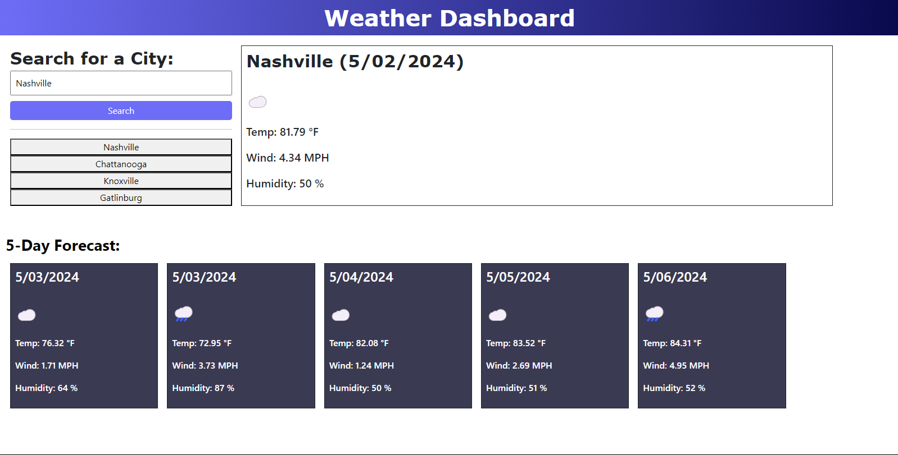

# 6-weather-dashboard

## Description

The sixth challenge assignment from a bootcamp where the task was to build a weather dashboard using server-side APIs.

## Table of Content
  -[Description](#Description)
  -[Process](#Process)
  -[Links](#Links)
  -[Installation](#Installation)
  -[TechnologiesUsed](#TechnologiesUsed)
  -[Usage](#Usage)
  -[Licenses](#Licenses)
  -[Contribution](#Contribution)
  -[Acknowledgement](#Acknowledgement)
  -[Questions](#Questions)

## Process

The process included creating a search input for any city. When a city was searched, the input value was put into an API url that was fetched for weather information. The API supplied by the bootcamp challenge needed an additional API called a geocode so that city inputs would translate into coordinates that inputted into the given url. Specific items in the arrays from the API data were selected to displayed the temperature, humidity, wind, and date in the web application. Additionally, a for loop was created for the five-day forecast to loop over several days. A conditional was put in place for the weather description to display a certain icon representing the weather. Four cities were saved in four buttons and when clicked on, presents the weather information for that city.

## Links

Link to website used for this challenge.
https://mackemo.github.io/6-weather-dashboard/

Link to public Github repository for this challenge.
https://github.com/mackemo/6-weather-dashboard

## Installation

To install this application, copy the ssh key from my github repo and clone it into your respository.

## Technologies Used

OpenWeather API

## Usage

This site was a practice assignment for bootcamp students but can be used to see how a simple website can be created by inspecting the webpage.

## License

N/A

## Contribution
  
Contact me by email provided in Questions section.

## Acknowledgement

Project was done by the knowledge learned from bootcamp instructor John as well as the additional resources listed below:

https://www.w3schools.com/css/css3_gradients.asp
https://www.w3schools.com/jsref/jsref_tofixed.asp#:~:text=JavaScript%20Number%20toFixed()&text=The%20toFixed()%20method%20converts,a%20specified%20number%20of%20decimals.

## Questions

Contact with questions at:
  
Email: mackenzielmoore14@gmail.com
Click [here](https://github.com/mackemo) for Github account.